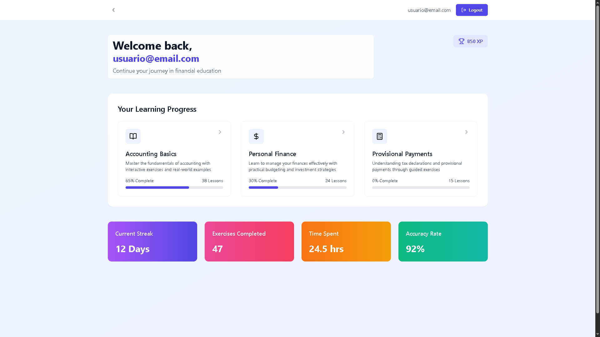
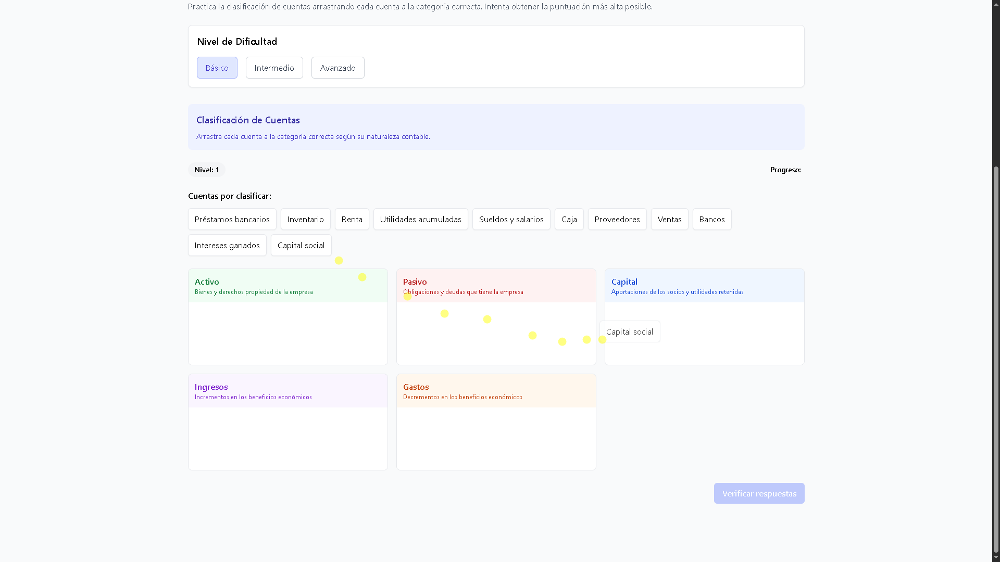
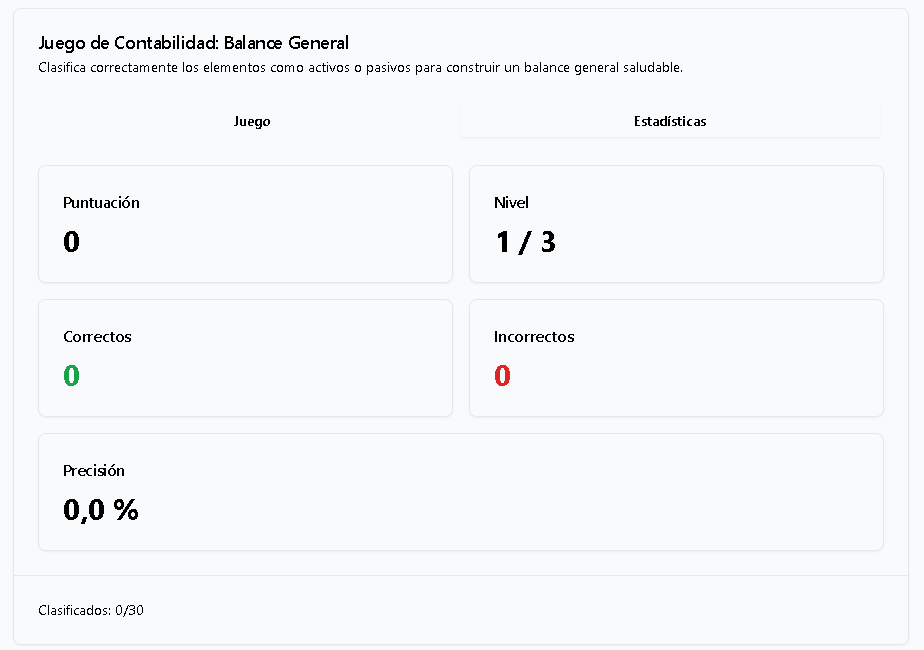
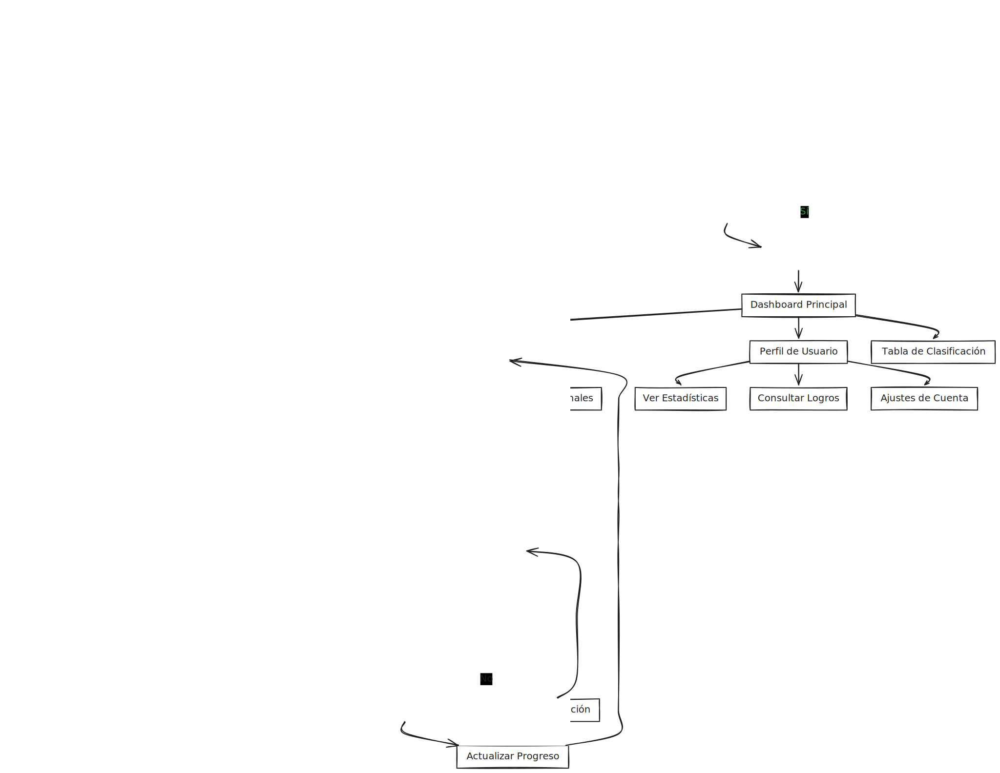
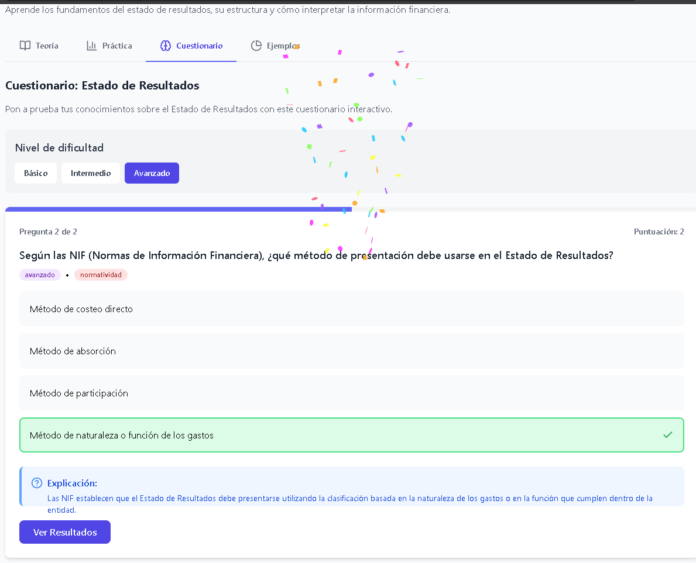
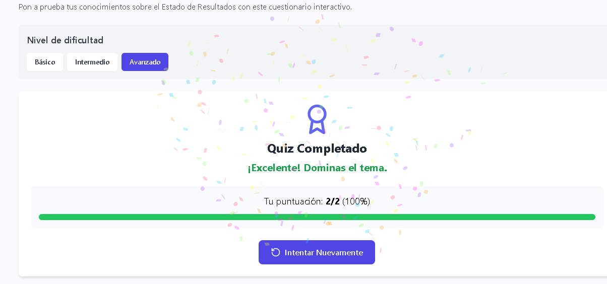

# MANUAL DE USUARIO - IEMS-CONTABLE

## SITIO WEB

IEMS-CONTABLE es una plataforma educativa interactiva diseñada para facilitar el aprendizaje de conceptos contables y financieros a través de ejercicios prácticos, juegos y contenido teórico estructurado. Este manual te guiará en el uso de todas las funcionalidades disponibles.

</img>

## ¿QUÉ ES ESTE SITIO WEB?

IEMS-CONTABLE es una aplicación web educativa especializada en la enseñanza de conceptos contables y financieros mediante técnicas de gamificación. A diferencia de los métodos tradicionales de enseñanza de contabilidad, nuestra plataforma ofrece:

- **Aprendizaje interactivo**: En lugar de simplemente leer conceptos, podrás aplicarlos inmediatamente a través de ejercicios prácticos y juegos.
  
- **Sistema de gamificación**: Acumula puntos, desbloquea logros y compite con otros usuarios para mantenerte motivado durante tu aprendizaje.
  
- **Contenido estructurado por módulos**: Desde conceptos básicos de contabilidad hasta temas avanzados como declaraciones fiscales, todo organizado en un camino de aprendizaje lógico.
  
- **Ejercicios adaptados a diferentes niveles**: Ya seas principiante o tengas conocimientos previos, encontrarás retos adecuados a tu nivel.
  
- **Experiencia personalizada**: El sistema guarda tu progreso, permitiéndote continuar desde donde lo dejaste y recomendando contenido basado en tu desempeño.

Esta plataforma ha sido diseñada tanto para estudiantes de contabilidad y finanzas como para profesionales que desean reforzar sus conocimientos o personas sin experiencia previa que necesitan aprender conceptos contables para emprendimientos o gestión personal.

</img>

</img>

## REQUERIMIENTOS MÍNIMOS PARA UTILIZARLO

Para utilizar IEMS-CONTABLE de manera óptima, necesitarás:

### Dispositivo:
- Ordenador de escritorio, portátil, tablet o smartphone
- Resolución de pantalla mínima recomendada: 1280x720 (aunque funciona en resoluciones menores)
- Para una mejor experiencia en juegos de arrastre, se recomienda usar pantalla táctil o ratón

### Navegador:
- Google Chrome (versión 88 o superior)
- Mozilla Firefox (versión 85 o superior)
- Safari (versión 14 o superior)
- Microsoft Edge (versión 88 o superior)

</img>

### Conexión a Internet:
- Conexión estable a Internet (mínimo 1 Mbps)
- Para juegos interactivos y videos, se recomienda 3 Mbps o superior

### Cuenta de usuario:
- Correo electrónico válido
- Opcional: Cuenta de Google para inicio de sesión rápido

## DIAGRAMA GENERAL DEL FUNCIONAMIENTO

</img>

## ¿CÓMO ACCEDER AL SISTEMA?

### Paso 1: Abrir el navegador
Inicia tu navegador web preferido (Chrome, Firefox, Safari o Edge).

### Paso 2: Acceder a la URL
En la barra de direcciones, escribe: `www.appcontable.com` (URL ilustrativa) y presiona Enter.

### Paso 3: Pantalla de bienvenida
Serás recibido por la pantalla de bienvenida que muestra una introducción a la plataforma y opciones para iniciar sesión o registrarse.

### Paso 4: Iniciar sesión o registrarse
- **Si ya tienes cuenta:** Haz clic en "Iniciar Sesión" e introduce tu correo electrónico y contraseña, o utiliza el botón "Continuar con Google".
- **Si eres nuevo:** Haz clic en "Registrarse", completa el formulario con tu información básica y sigue las instrucciones para crear tu cuenta.

### Paso 5: Verificación (solo nuevos usuarios)
Si te registras con correo electrónico, recibirás un enlace de verificación. Haz clic en él para activar tu cuenta.

### Paso 6: Dashboard principal
Una vez iniciada la sesión, accederás al dashboard principal donde podrás ver tu progreso, módulos disponibles y últimas actividades.

## CONTENIDO DE LA WEB

### 1. Dashboard Principal

El dashboard es tu centro de control personalizado, donde encontrarás:

- **Resumen de progreso**: Visualiza cuánto has avanzado en cada módulo.
- **Últimas actividades**: Consulta tus ejercicios recientes y puntuaciones.
- **Logros desbloqueados**: Mira qué insignias has conseguido en tu recorrido.
- **Módulos recomendados**: Sugerencias basadas en tu historial de aprendizaje.
- **Tabla de clasificación**: Posición respecto a otros usuarios según puntuación.

### 2. Módulos Educativos

#### 2.1 Conceptos Básicos de Contabilidad

Este módulo te introduce a los fundamentos contables a través de:

- **Visualizador de esquemas de mayor**: Explora 38 esquemas contables diferentes interactivamente.
- **Juego de clasificación de cuentas**: Arrastra y coloca cuentas en sus categorías correctas.
- **Balance general interactivo**: 
  - Aprende los componentes teóricos del balance
  - Juega a estructurar un balance general clasificando elementos como activos o pasivos
  - Visualiza estadísticas de tu desempeño
- **Estado de resultados**:
  - Contenido teórico sobre componentes e interpretación
  - Juego de estructuración con niveles progresivos de dificultad
  - Ejercicios prácticos con casos reales

#### 2.2 Finanzas Personales (En desarrollo)

Este módulo te ayuda a aplicar conceptos contables a tus finanzas personales:

- **Introducción a finanzas personales**: Conceptos básicos aplicados a la vida cotidiana.
- **Clasificación de costos**: Juego para identificar costos fijos vs. variables.
- **Estrategias para saldar deudas**: Contenido teórico y simuladores de pago.
- **Herramienta para proyectos**: Calculadora de costos para proyectos escolares o personales.

#### 2.3 Pagos Provisionales y Declaración Anual (Planificado)

Módulo avanzado orientado a aspectos fiscales:

- **Conceptos básicos fiscales**: Normatividad vigente explicada de forma accesible.
- **Plantillas de prellenado**: Guías interactivas para pagos provisionales.
- **Declaración anual**: Ejercicios prácticos para preparar declaraciones.

### 3. Perfil de Usuario

En tu perfil podrás:

- **Ver estadísticas detalladas**: Tiempo dedicado, ejercicios completados, precisión.
- **Gestionar logros**: Consulta los logros obtenidos y pendientes por desbloquear.
- **Ajustar preferencias**: Personaliza tu experiencia de aprendizaje.
- **Historial de actividades**: Revisa tu progreso a lo largo del tiempo.
- **Cambiar datos de cuenta**: Actualiza tu información personal o contraseña.

### 4. Sistema de Gamificación

Elementos que hacen tu aprendizaje más motivador:

- **Puntos**: Gana puntos al completar lecciones, ejercicios y juegos.
- **Logros**: Desbloquea insignias por alcanzar hitos específicos.
- **Tabla de clasificación**: Compite amistosamente con otros usuarios.
- **Efectos visuales**: Animaciones y confeti al completar desafíos exitosamente.
- **Progresión de niveles**: Desbloquea contenido más avanzado según tu desempeño.

### 5. Herramientas Interactivas

- **Juegos de arrastrar y soltar**: Clasifica elementos contables en sus categorías.
- **Cuestionarios interactivos**: Pon a prueba tus conocimientos teóricos.
- **Simuladores financieros**: Experimenta con diferentes escenarios contables.
- **Casos prácticos**: Aplica tus conocimientos a situaciones reales.

### 6. Soporte y Ayuda

- **Tutoriales**: Guías paso a paso para usar la plataforma.
- **Preguntas frecuentes**: Respuestas a dudas comunes sobre contenido o funcionalidad.
- **Glosario contable**: Diccionario de términos para consulta rápida.
- **Formulario de contacto**: Comunícate con el equipo de soporte para resolver dudas.

## TIPS PARA APROVECHAR AL MÁXIMO LA PLATAFORMA

1. **Sigue la secuencia recomendada**: Los módulos están diseñados para construir conocimiento progresivamente.

2. **Practica regularmente**: Dedicar 20-30 minutos diarios es más efectivo que sesiones largas ocasionales.

3. **Completa los ejercicios**: No te limites a la teoría; los juegos interactivos refuerzan significativamente el aprendizaje.

4. **Revisa tus estadísticas**: Analiza tu desempeño para identificar áreas de mejora.

5. **Participa en la comunidad**: Compara tu progreso con otros usuarios para mantenerte motivado.

6. **Utiliza diferentes dispositivos**: La plataforma está optimizada para funcionar en ordenadores, tablets y smartphones.

7. **Actualiza tu navegador**: Para disfrutar de todas las funcionalidades interactivas, mantén tu navegador actualizado.

</img>
</img>

---

© 2025 IEMS-CONTABLE - Todos los derechos reservados 